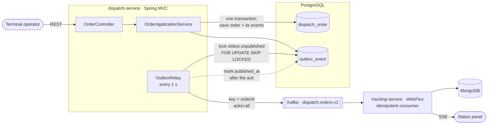

# fuel-dispatch-platform

Event-driven platform for scheduling and tracking marine fuel deliveries at a port terminal —
two Java 21 / Spring Boot microservices that communicate only through Kafka.

> 🚧 Work in progress, built phase by phase with Spec-Driven Development. See [Roadmap](#roadmap).

[](https://github.com/HuggsF/fuel-dispatch-platform/actions/workflows/ci.yml)
<!-- Badges: coverage (phase 06) -->

## Architecture



The two services never call each other: the only integration is the versioned event contract in
[`contracts/`](contracts/). Events are stored in the same transaction as the order and relayed
with at-least-once delivery, in order per order ([ADR 0004](docs/adr/0004-transactional-outbox-and-at-least-once-delivery.md)).

- **dispatch-service** — command side: order lifecycle and business rules, hexagonal architecture,
  transactional outbox.
- **tracking-service** — read side: idempotent Kafka consumer, reactive API and live status stream
  over Server-Sent Events ([ADR 0005](docs/adr/0005-reactive-read-side.md)).

## What this project demonstrates

| Capability | Where |
| --- | --- |
| Java 21, Spring Boot 3, Maven multi-module | `pom.xml`, both services |
| Hexagonal architecture, DDD, OOP | `dispatch-service/.../domain`, `application`, `adapter` |
| REST APIs, OpenAPI, RFC 9457 errors | `dispatch-service/.../adapter/in/web` |
| PostgreSQL, JPA, Flyway | `dispatch-service/.../adapter/out/persistence`, `db/migration` |
| Kafka, outbox pattern, event contracts | `adapter/out/messaging`, `contracts/` |
| Reactive programming (WebFlux, Reactor, SSE, backpressure), MongoDB | `tracking-service/` |
| Idempotent consumer, optimistic locking, out-of-order events | `tracking-service/.../domain`, `adapter/in/messaging` |
| Tests: JUnit 5, Mockito, Testcontainers, ArchUnit, StepVerifier, BlockHound | `src/test` in each service |
| Resilience: retry, DLT, circuit breaker | phase 05 |
| Observability: Prometheus, Grafana | `observability/` |
| Docker, Kubernetes, CI/CD | `Dockerfile`s, `deploy/k8s/`, `.github/workflows/` |
| Spec-driven, documented decisions | `specs/`, `docs/adr/` |

## How to run

Prerequisites: JDK 21 and Docker (with Compose v2). Maven is not needed — use the wrapper.

```bash
./mvnw verify                                  # build + unit/integration tests + format check (Windows: mvnw.cmd verify)
./mvnw spotless:apply                          # fix formatting before committing

docker compose up -d                           # PostgreSQL, MongoDB, Kafka, Kafka UI
docker compose ps                              # every service should be "healthy"

docker compose --profile apps up -d --build    # infrastructure + both services
curl http://localhost:8081/actuator/health     # dispatch-service → {"status":"UP"}
curl http://localhost:8082/actuator/health     # tracking-service → {"status":"UP"}

docker compose --profile apps down             # stop everything (add -v to drop the data volumes)
```

### Try the dispatch API

With `docker compose --profile apps up -d --build` running, Swagger UI is at
<http://localhost:8081/swagger-ui.html> (OpenAPI JSON at `/v3/api-docs`).

```bash
# Create an order → 201 Created, Location: /api/v1/orders/{id}
curl -i -X POST http://localhost:8081/api/v1/orders \
  -H 'Content-Type: application/json' \
  -d '{"vesselName": "Nordic Star", "vesselImo": "9321483", "berth": "B-03",
       "fuelType": "VLSFO", "quantityM3": 850.5,
       "windowStart": "2026-10-01T08:00:00Z", "windowEnd": "2026-10-01T14:00:00Z"}'

ID=<id from the Location header>

curl http://localhost:8081/api/v1/orders/$ID                        # read it
curl -X POST http://localhost:8081/api/v1/orders/$ID/approve        # CREATED → APPROVED
curl -X POST http://localhost:8081/api/v1/orders/$ID/dispatch       # APPROVED → DISPATCHED
curl -X POST http://localhost:8081/api/v1/orders/$ID/deliver        # DISPATCHED → DELIVERED
curl -X POST http://localhost:8081/api/v1/orders/$ID/cancel \
  -H 'Content-Type: application/json' -d '{"reason": "Vessel delayed"}'   # only from CREATED or APPROVED

curl 'http://localhost:8081/api/v1/orders?status=APPROVED&page=0&size=20'   # newest first
```

Errors are RFC 9457 `application/problem+json` bodies with a `code`, e.g. delivering an order that
was only approved:

```json
{"type": "about:blank", "title": "Invalid order transition", "status": 409,
 "detail": "Cannot DELIVER an order in status APPROVED",
 "code": "INVALID_TRANSITION", "currentStatus": "APPROVED", "action": "DELIVER"}
```

Codes: `VALIDATION_FAILED` (400, with an `errors` list of `field`/`message`), `MALFORMED_REQUEST`
(400), `ORDER_NOT_FOUND` (404), `INVALID_TRANSITION` (409), `CONCURRENT_MODIFICATION` (409),
`INTERNAL_ERROR` (500).

### See the events

Every state change is published to Kafka topic `dispatch.orders.v1` about a second after the
command, keyed by order id, following [`contracts/dispatch-order-event.v1.schema.json`](contracts/dispatch-order-event.v1.schema.json).
Open Kafka UI at <http://localhost:8090> → Topics → `dispatch.orders.v1` → Messages, or read the
topic from the command line:

```bash
docker compose exec kafka /opt/kafka/bin/kafka-console-consumer.sh --bootstrap-server kafka:19092   --topic dispatch.orders.v1 --from-beginning --property print.key=true --property print.headers=true
```

Events are stored in the same transaction as the order, so they are not lost while Kafka is down:
stop it with `docker compose stop kafka`, keep using the API, then `docker compose start kafka`
and the pending events are published.

### Watch orders live

`tracking-service` consumes those events into MongoDB and pushes every applied change to open
Server-Sent Event streams. In one terminal, open the stream (add `?orderId=$ID` for one order):

```bash
curl -N http://localhost:8082/api/v1/tracking/stream
```

In another, create and approve an order on 8081 as in [Try the dispatch API](#try-the-dispatch-api).
About a second after each command the stream prints the change, and a `:heartbeat` comment every
15 s keeps the connection open:

```text
id:807fcad5-cdc6-4587-af91-b3b2090ac0cb
event:status-changed
data:{"eventId":"807fcad5-...","orderId":"be5e7efa-...","status":"CREATED","occurredAt":"2026-09-30T16:28:13.430302Z","reason":null,"vesselName":"Nordic Star",...}

id:69f48051-8416-498b-812d-dfe03d5af6f1
event:status-changed
data:{"eventId":"69f48051-...","orderId":"be5e7efa-...","status":"APPROVED",...}

:heartbeat
```

Query the read side:

```bash
curl http://localhost:8082/api/v1/tracking/$ID          # current status, summary, history by occurredAt
curl -H 'Accept: application/x-ndjson' \
  'http://localhost:8082/api/v1/tracking?status=APPROVED' # streamed, one JSON per line (JSON array without the header)
```

Errors use the same RFC 9457 shape: `TRACKING_NOT_FOUND` (404), `VALIDATION_FAILED` (400, bad
UUID or missing/unknown `status`), `INTERNAL_ERROR` (500). Replaying an event is harmless: each
order remembers the event ids it applied, and an event older than the current status only goes
into the history.

| Component | Port |
| --- | --- |
| dispatch-service | 8081 |
| tracking-service | 8082 |
| PostgreSQL 16 | 5432 |
| MongoDB 7 | 27017 |
| Kafka (KRaft) | 9092 (from the host) · `kafka:19092` (inside the compose network) |
| Kafka UI | 8090 — browse topics and messages at <http://localhost:8090> |

Local credentials are development defaults in `docker-compose.yml`; override them by copying
`.env.example` to `.env`.

## Roadmap

- [x] 00 Foundation — Maven multi-module build, Docker Compose, CI, project board
- [x] 01 Dispatch domain — `DispatchOrder` aggregate, value objects, domain events, ArchUnit guard ([ADR 0002](docs/adr/0002-hexagonal-architecture-and-domain-events.md))
- [x] 02 Dispatch API — use cases, REST with RFC 9457 errors, PostgreSQL + Flyway, optimistic locking, OpenAPI
- [x] 03 Dispatch events — transactional outbox, Kafka relay (ordered per order, safe with several instances), versioned JSON Schema contract ([ADR 0004](docs/adr/0004-transactional-outbox-and-at-least-once-delivery.md))
- [ ] 04 Tracking service (reactive)
- [ ] 05 Resilience & observability
- [ ] 06 CI/CD & Kubernetes
- [ ] 07 Optional: AWS & Kotlin

Specs for every phase: [`specs/`](specs/README.md).

## Author

Hugo — backend engineer. Inspired by a real port fuel-logistics system I built in production.
<!-- LinkedIn link -->
